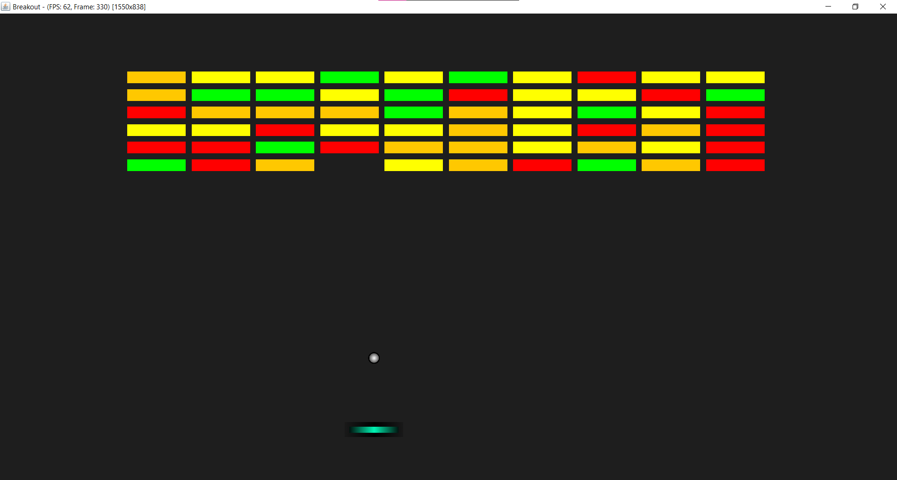

# JBreakout

## Summary

- [JBreakout](#jbreakout)
  - [Summary](#summary)
  - [Introduction](#introduction)
  - [Changelog](#changelog)
  - [Contributing to the project](#contributing-to-the-project)

## Introduction

This project is a Breakout type game, made in Java with Swing.
It started with the idea of creating a basic 2D game engine in Java, allowing the easy creation of objects and their interactions.

## Changelog

All notable changes to this project will be documented in the [CHANGELOG.md](CHANGELOG.md) file.

## Contributing to the project

Before starting, please read the [License](LICENSE) to understand the permissions and limitations of the project.
All information related to contributing to the project can be found in the [CONTRIBUTING.md](CONTRIBUTING.md) file. It is **mandatory** to read it before contributing to the project in order to follow the conventions and make the development process easier for everyone. Thank you for your understanding!
